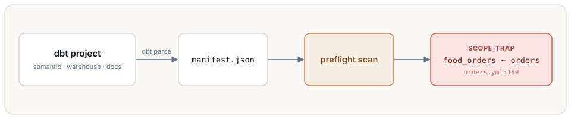

# preflight

**Stop your AI analyst from silently answering the wrong question.**

Static, cross-layer **ambiguity detection** for governed analytics. Before an agent (or a person) runs a
query, `preflight` compares the definitions it could ground on — semantic-layer metrics, warehouse
columns, documented terms — and flags the pairs that read alike but resolve to **different numbers**. It
reads your definitions, not your query logs, so it catches the confusion *before* someone returns a
confident wrong answer. No model, no questions, no warehouse run.

[](https://github.com/d-n-ust/preflight-analytics/actions/workflows/ci.yml)
[](LICENSE)
[](pyproject.toml)
[](https://github.com/astral-sh/ruff)
[](https://mypy-lang.org/)

**[Quickstart](docs/dbt-quickstart.md)** · **[Finding catalog](docs/catalog.md)** · **[Library](docs/library.md)** · **[CI / guardrail](docs/ci.md)**

<p align="center">
  
</p>

Point it at a dbt project and it finds real traps. Here is one in dbt-labs' own Semantic Layer template,
found in seconds and cited to the line an analytics engineer edits:

```text
$ preflight scan . --dialect dbt-manifest
11 findings — high 4, medium 0, low 7

HIGH (4)
  models/marts/customer360/orders.yml:139: [SCOPE_TRAP] food_orders[sem]  ~  orders[sem]
      same measure; 'food_orders' is 'orders' plus a filter — bare question silently scoped, swap invisible
  ...
```

`food_orders` is `orders` with a hidden filter, so a bare "how many orders?" silently under-counts — and
the number looks completely plausible. That is the failure preflight exists to catch.

**Why it helps.** When two plausible metrics exist for one question, an AI agent (or a hurried human)
can silently pick the wrong one, and the number looks fine. preflight finds those forks in CI, each
cited to the source `.yml`/`.sql` line, so you fix them before they ship. It covers the **selection**
half of grounding safety — two valid definitions exist and the wrong one gets picked. (Whether a single
definition is internally correct is a separate job.)

## Install

Not on PyPI yet — it publishes as `preflight-analytics` (the bare `preflight` name is taken); the
import and the CLI command both stay `preflight`. For now, install from source with
[uv](https://docs.astral.sh/uv/):

```bash
uv tool install .                 # core: structural detection on a lexical gate (no torch)
uv tool install ".[embeddings]"   # + the sharper, validated gate — see docs/gate.md

# or straight from GitHub, without cloning:
uv tool install "git+https://github.com/d-n-ust/preflight-analytics"
```

## Use

```bash
preflight scan . --dialect dbt-manifest            # scan a dbt project
preflight scan . --dialect dbt-manifest --detail   # + the offending source line
```

Every finding is cited to `path:line`. New here? **[docs/dbt-quickstart.md](docs/dbt-quickstart.md)** walks a real dbt
project (jaffle shop) end to end in a few commands.

## What it finds

| type | one line |
|---|---|
| **SCOPE_TRAP** | a metric is another metric plus a hidden filter |
| **CONCEPT_FORK** | one concept, several metrics over different columns |
| **GRAIN_MISMATCH** | a number that should not be added up over time, offered per day |
| **DEFINITION_DIVERGENCE** | one term defined two ways, or a metric its docs never describe |
| **NAME_COLLISION** | two names read alike, or one column name reused across tables |
| **DUPLICATE** | the same thing under two names |
| **SIBLING** | the same measure under two incomparable scopes |

Each is a real confusion that returns a wrong number. A worked example and the recommended fix for every
one: **[docs/catalog.md](docs/catalog.md)**.

## dbt

```bash
dbt parse                                # your dbt, your profile -> target/manifest.json
preflight scan . --dialect dbt-manifest
```

Generating the manifest is your dbt project's job; preflight only reads it (if you already use dbt, CI
has produced it). Full walkthrough, both jaffle projects, and the manifest details:
**[docs/dbt-quickstart.md](docs/dbt-quickstart.md)**.

Not on dbt? preflight reads **Cube** models directly — no build step — with `--dialect cube`
(walkthrough: **[docs/cube-quickstart.md](docs/cube-quickstart.md)**), plus raw dbt model SQL
(`--dialect dbt`), MetricFlow YAML (`--dialect metricflow`), and a native `semantic/warehouse/docs`
layout (`--dialect env`).

## Library

```python
from preflight import scan
for f in scan("path/to/environment"):
    print(f.danger, f.type, f.note)
```

Adapters, `detect_collisions`, `DetectConfig`, and JSON output: **[docs/library.md](docs/library.md)**.

## Guardrail (CI / pre-commit)

```bash
preflight scan . --dialect dbt-manifest --fail-on high   # non-zero exit on a HIGH finding
```

Drops into GitHub Actions or a pre-commit hook — setup in **[docs/ci.md](docs/ci.md)**.
